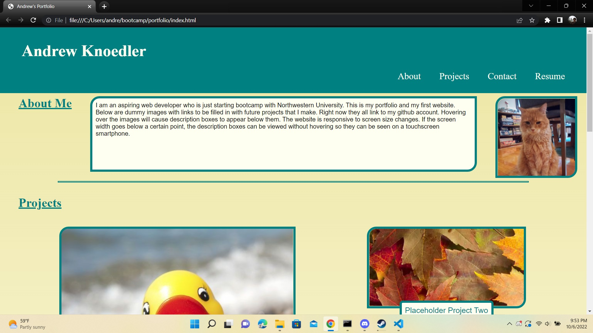
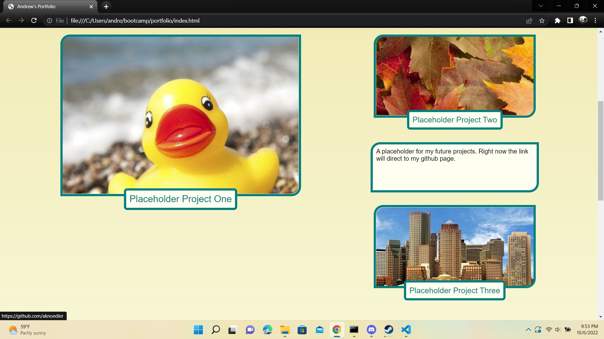
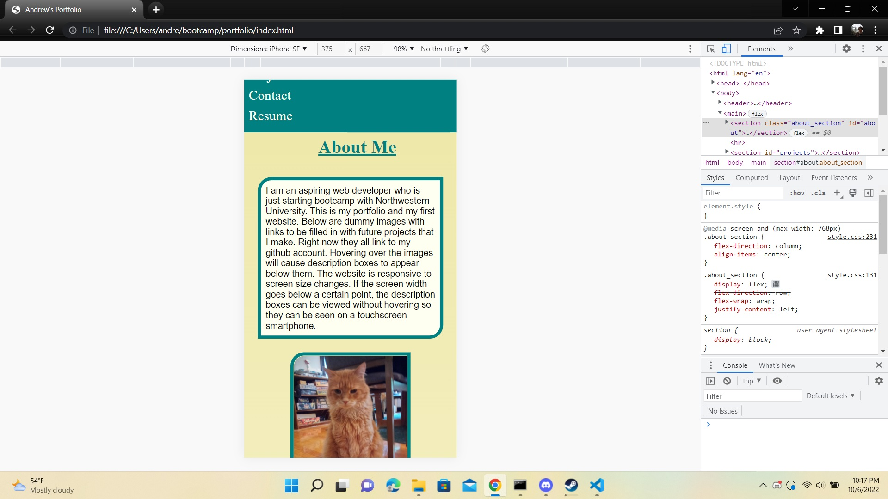

# Portfolio

This website serves as a portfolio for my work as a web developer. It includes a short bio, an
avatar (a picture of one of my cats), contact info, and images with links to projects. Since I 
currently don't have projects to link to, for now these link to my Github account. By the end of 
the class I hope to have exciting projects to show off!

## Installation

N/A

## Usage

The website is screen-responive- it will adjust the organization of the elements based on screen 
size. Hovering over the image links will cause short descriptions of the projects to appear below
them. On a smartphone sized screen these are always displayed, since the hover option doesn't
exist on a touchscreen.

## Screenshots

Mobile responsive screenshot

## Contributing

N/A

## License

N/A